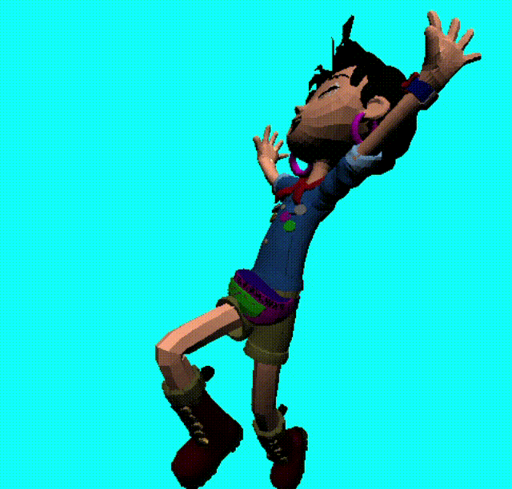

# Swing Rasterizer

## Introduction 
A forward shading rasterizer using Swing.

## Demo

using a model from the [Ellie Pose Library](https://www.blender.org/download/demo-files/).

## Requirement
* openjdk version "11.0.16.1" 2022-08-12 LTS

## Features
* Material loading (Diffuse, Specular)
* Vertex colors
* Lighting: Phong reflection model
* Back-face Culling
* Near-Far Clipping

## Usage
Run `Main.java` 🫠

## License
This is under the [MIT license](https://en.wikipedia.org/wiki/MIT_License).

